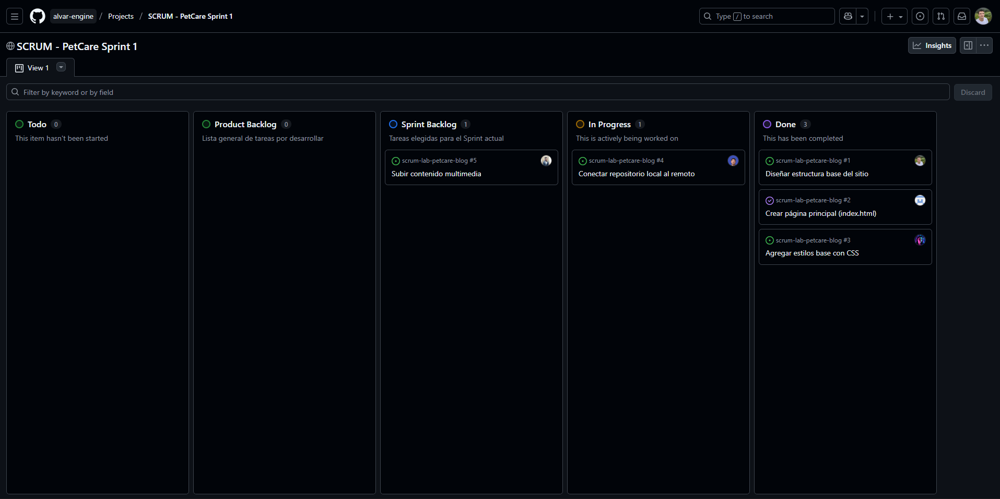

# 🧩 Proyecto – Tablero SCRUM y Flujo de Trabajo con Git

Este repositorio forma parte de un proyecto colaborativo gestionado mediante la metodología **SCRUM**.  
El equipo trabajó utilizando **ramas individuales**, un **tablero de tareas** y un flujo de revisión de código basado en **pull requests**.

---

## 🚀 Descripción general

El objetivo del proyecto fue **organizar el desarrollo en equipo** usando buenas prácticas de control de versiones y trabajo ágil.  
Cada miembro del equipo creó su propia rama, desarrolló sus tareas asignadas y subió los cambios al repositorio remoto una vez completados.

El tablero SCRUM se utilizó para **gestionar el progreso de las tareas**, desde la planificación hasta la entrega final.  
De esta forma, se garantizó un flujo ordenado, comunicación continua y control de versiones seguro.

---

## 📋 Estructura del flujo de trabajo

1. **Planificación (Sprint Planning)**  
   - El equipo definió las tareas a realizar durante el sprint.  
   - Cada tarea se agregó al tablero SCRUM con su descripción, prioridad y responsable.  

2. **Asignación de tareas**  
   - A cada integrante se le asignó una tarea específica.  
   - Cada tarea contaba con su propio identificador y estado dentro del tablero (Backlog, To Do, In Progress, Code Review, Done).  

3. **Creación de ramas individuales**  
   - Cada miembro creó su **rama personal** para trabajar su tarea sin afectar la rama principal del proyecto.  
   - El nombre de la rama reflejaba el tipo de tarea o la funcionalidad desarrollada (por ejemplo, `feature-login`, `fix-diseño`, etc.).  

4. **Desarrollo y commits**  
   - Cada participante desarrolló su funcionalidad de manera independiente.  
   - Se realizaron **commits claros y descriptivos** que facilitaron el seguimiento de los cambios.  

5. **Revisión de código (Code Review)**  
   - Una vez completada la tarea, se subieron los cambios al repositorio remoto.  
   - Se abrió un **pull request** para que los demás miembros revisaran el código antes de integrarlo.  
   - Este proceso permitió detectar errores, mantener un estándar de calidad y fomentar la colaboración.  

6. **Integración en la rama principal**  
   - Tras la aprobación del pull request, los cambios fueron integrados en la rama principal del proyecto.  
   - Esto garantizó que el código en la rama principal siempre estuviera estable y actualizado.  

7. **Cierre de tareas**  
   - Una vez integrados los cambios, la tarea fue marcada como **completada (Done)** en el tablero SCRUM.  
   - Se realizó una breve revisión final en equipo para evaluar los resultados del sprint.  

---

## 🧱 Estructura del repositorio

- **main o master:** rama principal del proyecto, con el código estable.  
- **feature/**: ramas creadas para el desarrollo de nuevas funcionalidades.  
- **fix/**: ramas utilizadas para corregir errores o ajustes específicos.  
- **docs/**: documentación y archivos informativos del proyecto.  
- **.gitignore:** archivo que define qué elementos no deben incluirse en el control de versiones.

---

## 🧩 Herramientas utilizadas

- **Git** y **GitHub** para el control de versiones y colaboración.  
- **Tablero SCRUM** (GitHub Projects, Trello o similar) para la gestión ágil de tareas.  
- **Pull Requests** para revisión e integración de código.  
- **Commits descriptivos** para mantener trazabilidad y orden.  

---

## 🧠 Buenas prácticas aplicadas

- Cada miembro trabajó en su **propia rama** para evitar conflictos.  
- Se fomentó la **revisión cruzada de código** (code review).  
- Se usaron **mensajes de commit claros y concisos**.  
- El tablero SCRUM se mantuvo **actualizado durante todo el proceso**.  
- Se evitó modificar directamente la rama principal sin revisión previa.  

---

## 🤝 Colaboración en equipo

El proyecto se desarrolló de forma colaborativa, aplicando principios de comunicación y autogestión.  
Cada integrante participó en:
- La **planificación de tareas**.  
- El **desarrollo individual** de funcionalidades.  
- La **revisión de código** de sus compañeros.  
- El **seguimiento del avance** en el tablero SCRUM.  

---

## 🏁 Resultado

Gracias al uso del tablero SCRUM y la gestión mediante Git:
- Se mantuvo un flujo de trabajo claro y organizado.  
- Todos los miembros pudieron contribuir simultáneamente sin conflictos.  
- El código final fue integrado de manera segura y revisada.  
- El equipo fortaleció su coordinación y buenas prácticas en desarrollo colaborativo.  

---

## 📄 Licencia

Este proyecto se distribuye con fines académicos y de práctica colaborativa.  
Puede adaptarse libremente según las necesidades de cada equipo o entorno de desarrollo.

---

